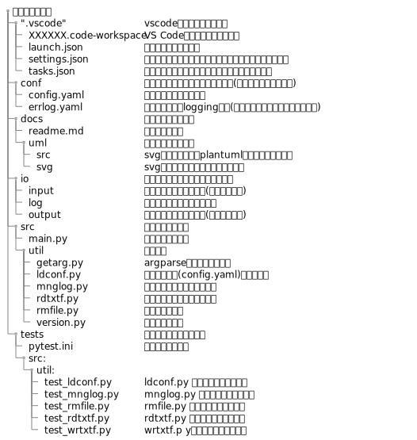

# ツール説明書テンプレート

## 概要
[TODO]ツールの内容を書く

## 動作環境
|アイテム  |バージョン  |備考  |
|:--------|:--------|:--------|
|OS|Windows 11 以降||
|Python     |3.12.0 以降||
|必要なライブラリ|ライセンスの項に記載||

## ライセンス
下記のオープンソースライセンスを使用しています。
|名称|バージョン|作者|ライセンスの種類|用途|
|:--|:--|:--|:--|:--|
|[PyYAML](https://pypi.org/project/PyYAML/)|6.0.1|Kirill Simonov|MIT License (MIT)|yamlのパース|
|[pytest](https://pypi.org/project/pytest/)|7.4.3|Holger Krekel, Bruno Oliveira,<br>Ronny Pfannschmidt, Floris Bruynooghe,<br>Brianna Laugher, Florian Bruhin<br>and others|MIT License (MIT)|単体検査|
|[pytest-cov](https://pypi.org/project/pytest-cov/)|4.1.0|Marc Schlaich|MIT License(MIT)|検査カバレッジ計測・レポート作成|
|[pytest-mock](https://pypi.org/project/pytest-mock/)|3.12.0|Bruno Oliveira|MIT License(MIT)|検査用モック|
|[pytest-html](https://pypi.org/project/pytest-html/)|4.1.1|Dave Hunt|MIT License(MIT)|検査レポート作成|

<div style="page-break-before:always"></div>

## 入出力ファイル
### 入力ファイル
- [TODO]入力ファイルを書く
### 出力ファイル
- (ファイル名固定) logs/error.log: 実行ログ
  [TODO]出力ファイルを書く
### 設定ファイル
- (ファイル名固定) conf/errlog.yaml: モジュール別のlogging設定

## 使用方法
コマンドラインにて下記コマンドを入力して実行
```sh
(venv)>python XXXXX.py [オプション] [オプション]
```

### オプション

|スイッチ  |必須/任意  |既定値  |説明  |
|---------|---------|---------|---------|
|-v, --version|任意|なし|バージョン情報を表示する|
|-i|任意|../io/input/input.txt|入力ファイル名|
|-o|任意|../io/output/output.txt|出力ファイル名|
> [!NOTE]
> 入力も出力も`io`フォルダ内である必要はありません。

<div style="page-break-before:always"></div>

## ファイル構成


### ファイルの内容
|階層|項目|内容|例|
|:----|:--|:--|:--|
|1|module|srcを起点としたモジュール名|`util.ldconf`|
|2|error_key|モジュール内でユニークなエラーコード|`E0010`など任意の文字列|
|3|`message`|エラー発生時に表示させるエラー内容|'入力ファイルが開けません'など|
|3|`cause`|エラー発生時に表示させるエラーの原因|'入力ファイルが存在しない'など|
|3|`solution`|エラー発生時に表示させる対処法|入力ファイルの存在、引数を確認してください|

1. YAMLファイルはPythonのようにインデントで階層構造を表現します。
2. モジュールは名前空間になっており、`error_key`はモジュールが異なれば衝突しません。
`module`と`error_key`でエラーに紐づけます。`message`以下は複数行記述可能です。

> [!CAUTION]
> `message`以下は`|`の付け忘れに注意してください。

</div>